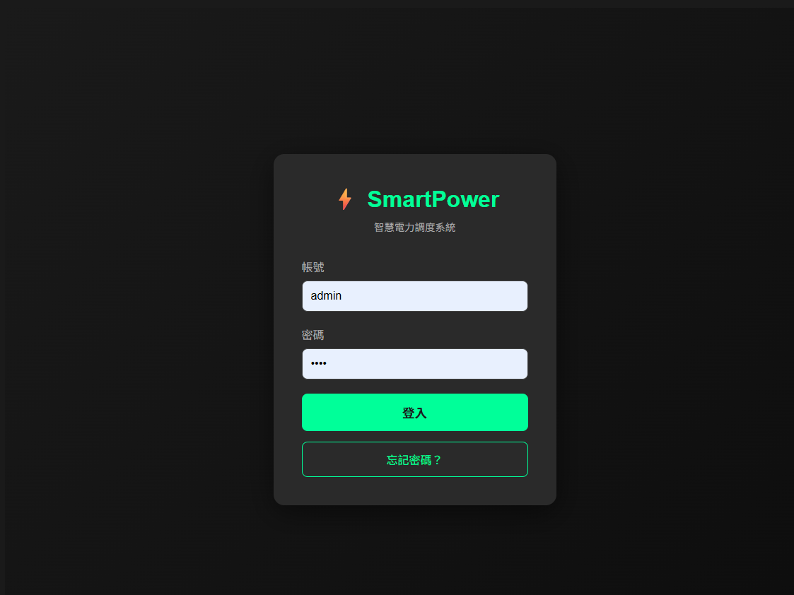
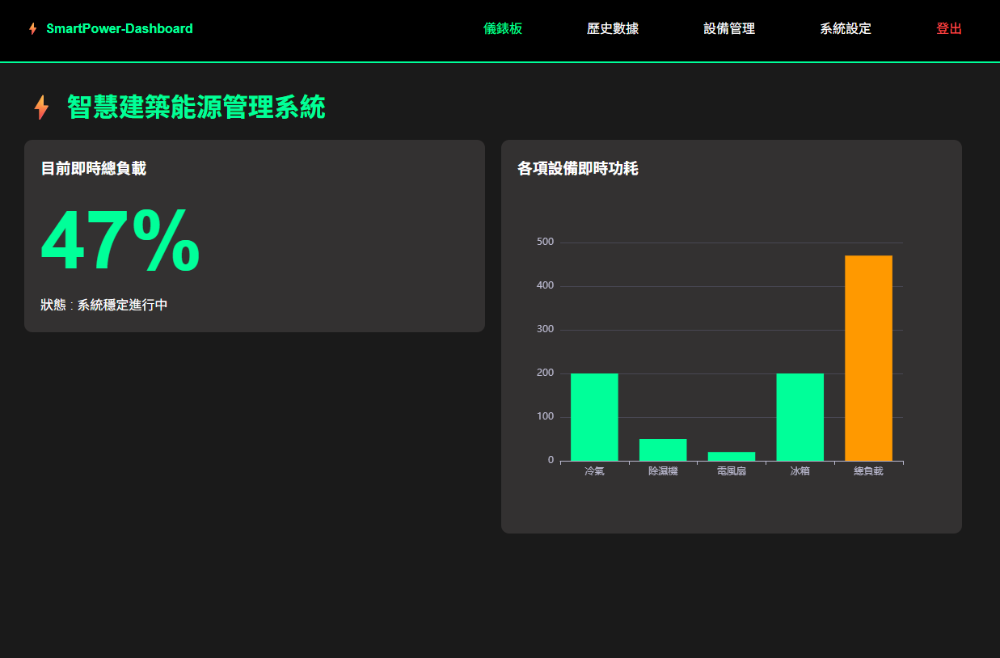
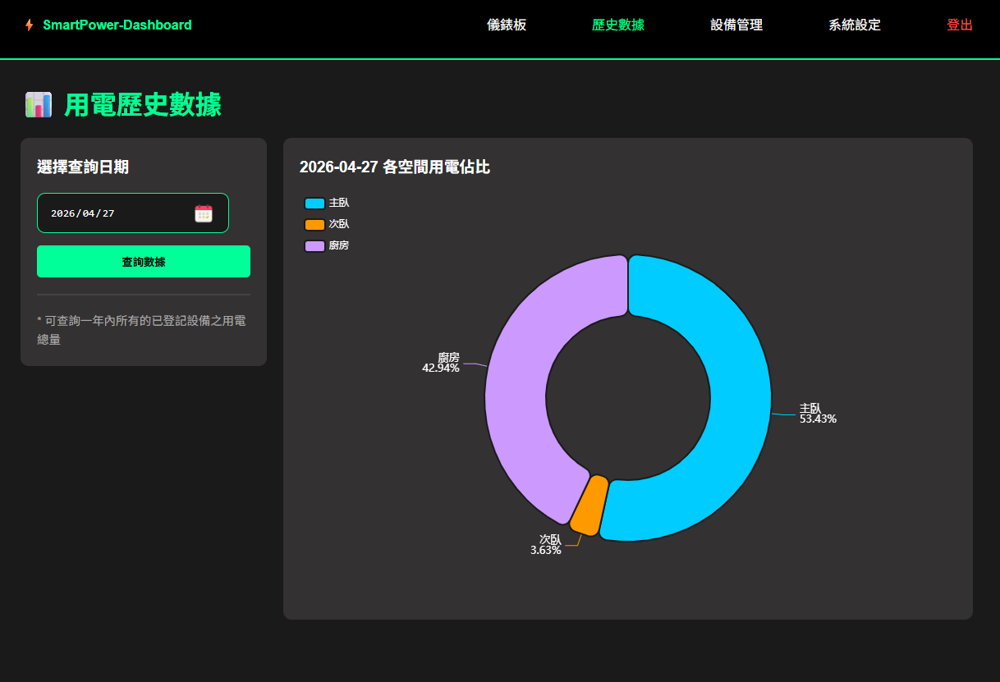
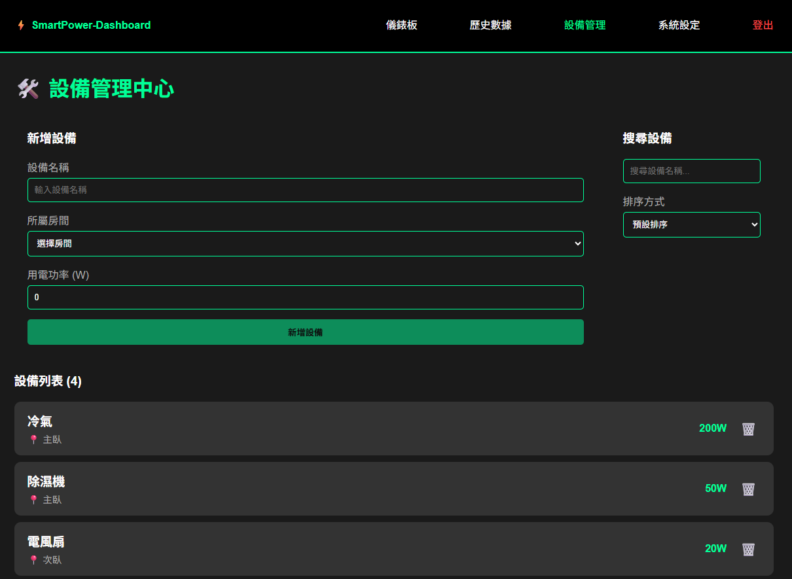
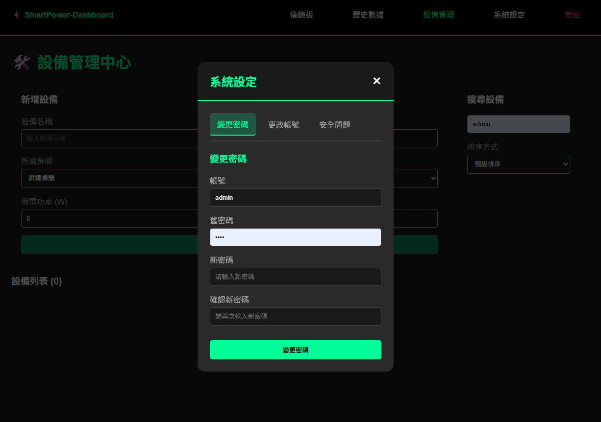

# 智慧建築能源管理系統

## 專案介紹
本系統主要用於監控建築內各設備的用電狀況，並提供歷史數據分析與設備管理功能，協助管理者即時掌握能耗情形並提升能源使用效率。

開發過程中有使用 AI 工具輔助（UI 生成與程式碼建議），但核心架構設計、API 串接與資料庫設計皆由本人完成並進行優化。

---

## 功能介紹
- 設備用電儀表板（即時監控各設備用電狀況）
- 歷史查詢功能（支援時間區間查詢）
- 設備管理系統（新舊設備管理）
- 使用者帳號與密碼管理
- 視覺化數據分析（使用 ECharts 呈現用電趨勢與統計圖表）

---

## 技術架構

### 前端技術
- Vue.js
- JavaScript
- ECharts
- HTML / CSS
- Vite

### 後端技術
- Node.js
- RESTful API
- Microsoft SQL Server
- JSON

---

## 專案畫面

### 登入介面


### 儀錶板


### 歷史查詢


### 設備管理


### 系統設定


---

## 測試帳號

系統提供以下測試帳號供測試使用：

- 帳號：admin  
- 密碼：0000  

---

## 安裝與執行方式

1. 開啟終端機

2. Clone 專案
```bash
git clone https://github.com/你的GitHub帳號/smart-power-dashboard.git
```

3. 進入專案資料夾
```bash
cd smart-power-dashboard
```

4. 安裝依賴
```bash
npm install
```

5. 啟動後端
```bash
node server/index.js
```

6. 開啟新終端機並啟動前端
```bash
cd smart-power-dashboard
npm run dev
```